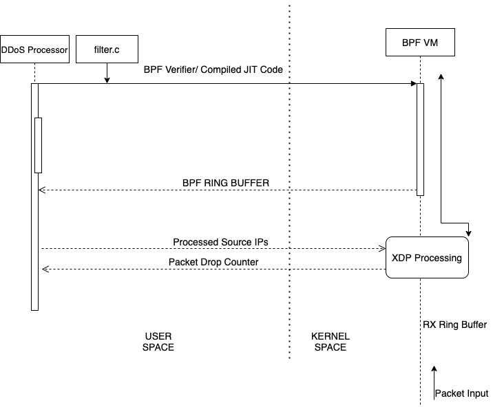
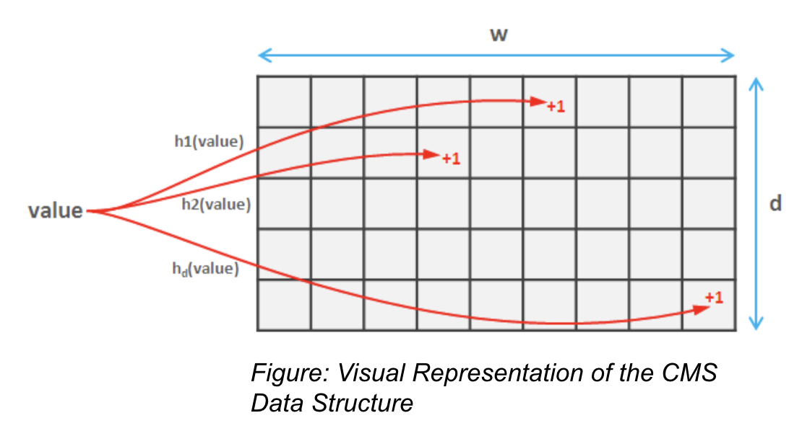
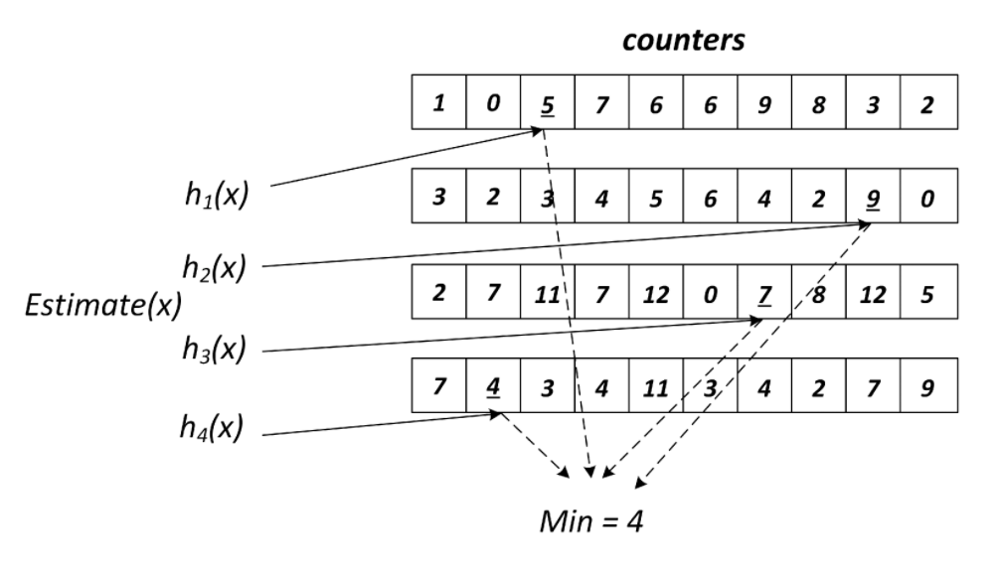
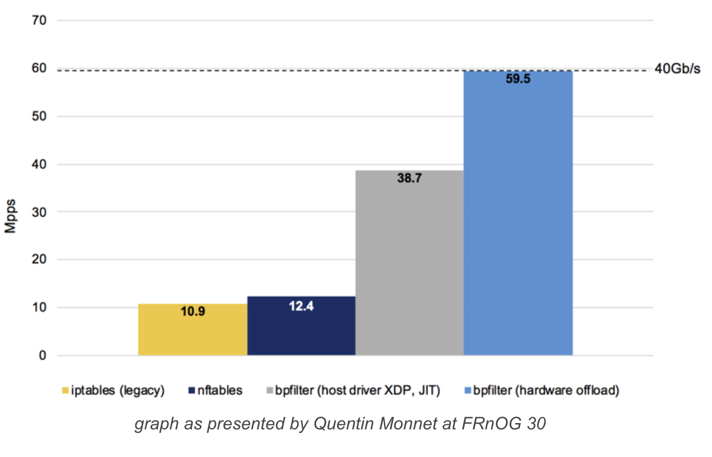
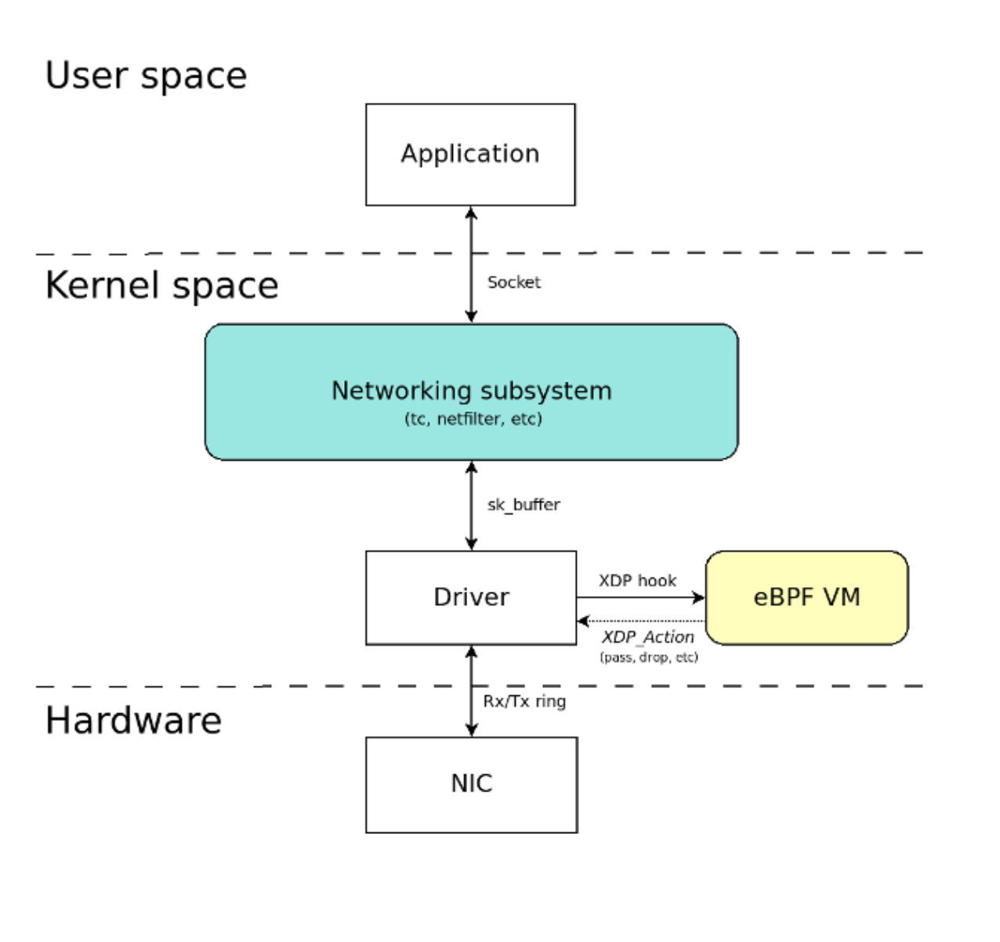
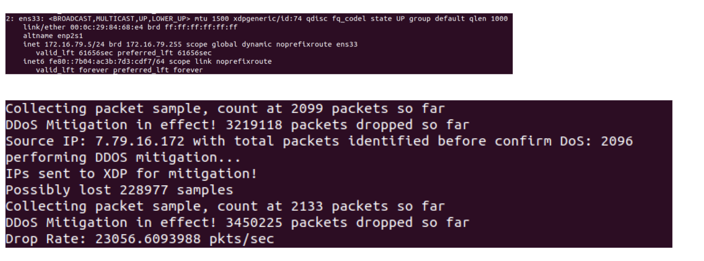

# DDoS_Processor
A Distributed Denial of Service Detector and mitigator based on Extended Berkeley Packet Filters (eBPF) and Xpress Data Path (XDP)

## Workflow

- Heavy Hitters Estimation
- Clean Pipe Approach

### Working
#### Approximate Heavy Hitters and the Count-Min Sketch
The program solves the problem of approximate heavy hitters by incorporating the use of probabilistic count. This is achieved through the use of Count Min Sketch. 

The problem of Heavy Hitters; 

An array A of length n, and also a parameter k. Think of n as very large (in the hundreds of millions, or billions), and k as modest (10, 100, or 1000). The goal is to compute the values that occur in the array at least n/k times.

Solution? 

Use Count Min Sketch Data structure to provide 
a fixed, sublinear storage to process A and find
Approx count of values.

D = number of non cryptographic hash functions
W = no. of digits of the output of the hash function

#### CountMinSketch

- Insert: 
  - Structure initialized with zeros 
  - Each stream input goes through the hash functions
  - Output of hash function determines the column that needs to be updated in the structure. 
  - Increments of  1.

- Count: 
  - Pass value to hash functions
  - O/p of hash functions determines the locations 
  - Obtain values at locations. Choose minimum. 

- Advantages: 
  - Size of the structure independent of input
  - Lossy count with no under-counting.

#### Express Data Path
eXpress Data Path provides a high performance, programmable network data path in the Linux kernel.

XDP provides bare metal packet processing at the lowest point in the software stack which makes it ideal for speed without compromising programmability.

Can be implemented dynamically with the integrated fast path without kernel modification.

eBPF can be used to write XDP programs.

Trusted Technology - Used by Cloudflare, Facebook, Netronome, Prometheus, and many more.

### Performance Comparisons

### Packet Flow and use of eBPF

Ring Buffers: Ring buffers are shared buffers between the device driver and Network Interface Card (NIC). These buffers store incoming packets until the device driver can process them. Ring buffers exist on both the receive (rx) and transmit (tx) side of each interface.

eBPF VM: Register-based Virtual Machine using a custom 64 bit RISC instruction set capable of running Just-in-Time native-compiled "BPF programs" inside the Linux kernel with access to a subset of kernel functions and memory. It is a full VM implementation, not to be confused with the Kernel-based VM (KVM) which is a module enabling Linux to act as hypervisor for other VMs. It is also part of the mainline kernel

### Screenshots 

### Future Work
Time-bound sample of 1M packets. If Sample does not reach the set size in set amount of time, No DDoS.
Feedback loop to clear old entries.
Dynamically control threshold for heavy hitters.
Feed Live stream to Count Min Sketch.
Combine various DDoS Detection Algorithms - Entropy, Packet Size.
